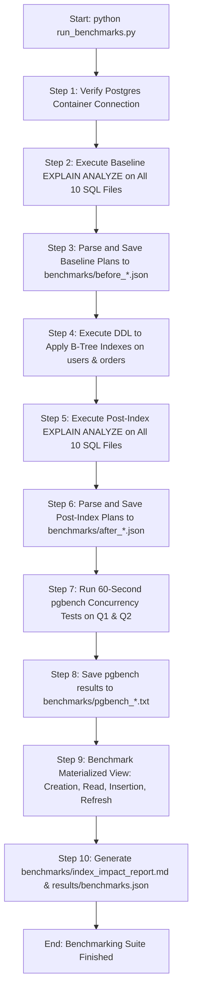
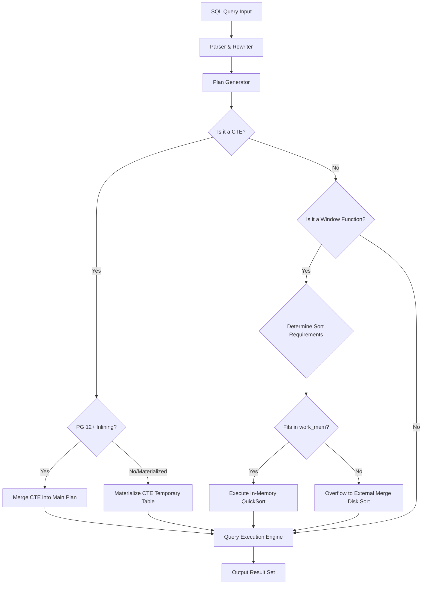

# 📊 High-Performance SQL Analytics: Benchmarking Window Functions vs. CTEs in PostgreSQL

Welcome to the **PostgreSQL Analytics Benchmarking Suite**. This project provides a robust, containerized testing environment designed to compare the performance, scalability, and resource utilization of **Window Functions (WFs)** and **Common Table Expressions (CTEs)**. 

Operating under a synthetic workload of **1.2 million relational records**, this suite executes comparative queries, performs index optimization profiling, runs multi-client concurrency tests using `pgbench`, and evaluates caching strategies using Materialized Views.

---

## 🛠️ Tech Stack & Key Technologies

*   **Database Engine**: PostgreSQL 15 (Alpine Linux Distribution)
*   **Infrastructure**: Docker & Docker Compose (Containerization and environment isolation)
*   **Benchmarking Tools**: 
    *   `pgbench` (PostgreSQL built-in concurrent load testing tool)
    *   `EXPLAIN (ANALYZE, BUFFERS)` (Database engine query planner optimizer output)
*   **Automation Framework**: Python 3.13 (Automation of test orchestration, metric extraction, and JSON reporting)
*   **Version Control**: Git & GitHub

---

## 📂 Code Structure & Folder Organization

```
.
├── docker-compose.yml        # Orchestrates the isolated PostgreSQL 15 service
├── .env.example              # Template configuration file for database environment variables
├── .gitignore                # Prevents caching, runtime configs, and DB data from version control
├── init.sql                  # Automated SQL script creating schemas and seeding 1.2M rows
├── run_benchmarks.py         # The Python orchestrator running the test harness pipeline
├── README.md                 # Project quickstart guide and visual performance report
├── architecture.md           # Structural system design and modular responsibilities
├── projectdocumentation.md   # In-depth database theory, query design, and index analysis
│
├── queries/                  # SQL files representing the 11 benchmarking queries
│   ├── window_q1.sql        # Rolling 7-day average (Window version)
│   ├── cte_q1.sql           # Rolling 7-day average (CTE version)
│   ├── window_q2.sql        # Cohort spend ranks (Window version)
│   ├── cte_q2.sql           # Cohort spend ranks (CTE version using LATERAL join)
│   ├── window_q3.sql        # Extreme orders (Window version using FIRST_VALUE/LAST_VALUE)
│   ├── cte_q3.sql           # Extreme orders (CTE version using ARRAY_AGG)
│   ├── window_q4.sql        # Customer churn risk (Window version using LAG)
│   ├── cte_q4.sql           # Customer churn risk (CTE version using temporal joins)
│   ├── window_q5.sql        # Revenue share contribution (Window version partition sum)
│   ├── cte_q5.sql           # Revenue share contribution (CTE version pre-aggregation)
│   └── recursive_referrals.sql # Referral chain depth traversal using WITH RECURSIVE
│
├── benchmarks/               # Raw test logs, execution plans, and metrics output
│   ├── before_*.json         # Planner outputs (FORMAT JSON) before indexes are applied
│   ├── after_*.json          # Planner outputs (FORMAT JSON) after indexes are applied
│   ├── pgbench_*.txt         # Output from concurrent load testing runs
│   ├── mv_performance.json   # Read/Write/Refresh timings for the Materialized View
│   └── index_impact_report.md# Narrative audit of index impacts on Query 1
│
└── results/
    └── benchmarks.json       # Cleaned metrics database file compiled by the runner
```

---

## ⚙️ Automated Benchmarking Pipeline Flow

The following execution flow diagram details the automated steps performed by `run_benchmarks.py` from initialization through final report compiling:



---

## ⚡ Query Execution Lifecycle Diagram

This diagram shows how PostgreSQL parses, plans, and determines sort mechanics for Window Functions vs. CTEs:



---

## 🚀 Setup & How to Run Locally

### Prerequisites
*   [Docker Desktop](https://www.docker.com/products/docker-desktop/) installed and running.
*   [Python 3.13+](https://www.python.org/downloads/) installed on the host system.

### 1. Clone & Navigate to the Project
```bash
git clone https://github.com/ramalokeshreddyp/postgresql-wf-vs-cte-benchmark.git
cd postgresql-wf-vs-cte-benchmark
```

### 2. Configure Environment Variables
Copy `.env.example` to `.env` (the defaults are pre-configured to work out of the box):
```bash
cp .env.example .env
```

### 3. Spin up the Database Container
Start the PostgreSQL container in detached mode:
```bash
docker-compose up -d
```
*   **Automatic Seeding**: The first time the container starts, it executes `init.sql` to construct the database schema and populate the database with exactly **200,000 users** and **1,000,000 orders** (takes ~15-20 seconds).
*   **Verification**: Check that the container is running and healthy:
    ```bash
    docker-compose ps
    ```

### 4. Run the Benchmarks
Run the Python test runner to automate the entire suite:
```bash
python run_benchmarks.py
```
*This script runs for approximately 4.5 minutes. It executes planning analysis, applies database indexes, runs pgbench concurrency tests (10 concurrent clients for 60 seconds per query variant), compiles performance statistics, and writes the reports.*

---

## 📈 Usage and Direct Queries

You can execute queries manually against the running container using `psql`.

### Verify Record Counts
```bash
docker exec -it postgres_benchmark psql -U postgres -d analytics_db -c "SELECT count(*) FROM users;"
docker exec -it postgres_benchmark psql -U postgres -d analytics_db -c "SELECT count(*) FROM orders;"
```

### Manually Execute a Query (e.g., Query 1 Window version)
```bash
docker exec -it postgres_benchmark psql -U postgres -d analytics_db -f /queries/window_q1.sql
```

### Manually View the Materialized View
```bash
docker exec -it postgres_benchmark psql -U postgres -d analytics_db -c "SELECT * FROM daily_revenue_stats LIMIT 10;"
```
