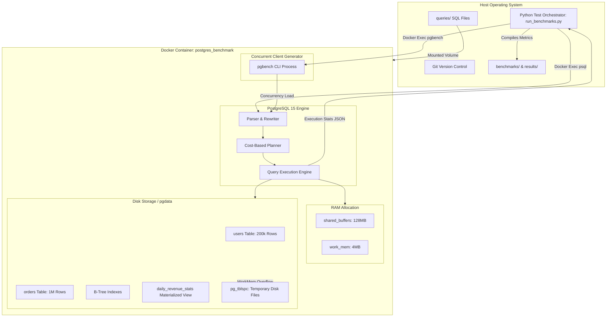
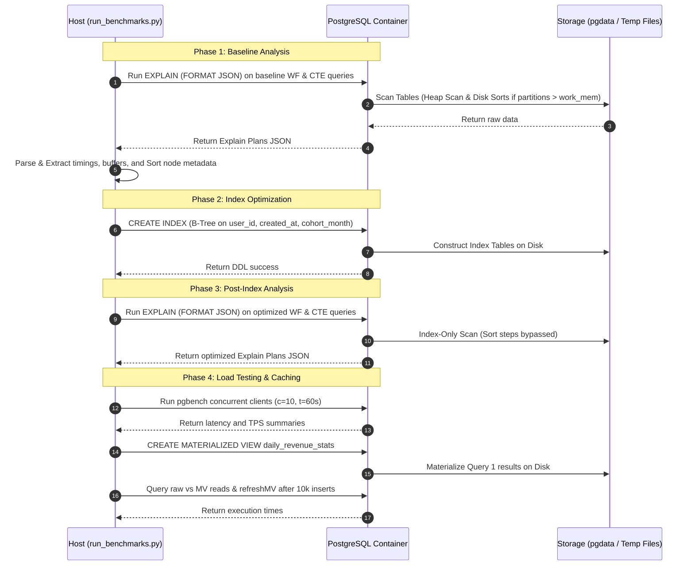

# 🏛️ System Architecture and Design Document

This document outlines the architectural blueprint, design choices, system components, and data flow strategies of the **PostgreSQL Window Functions vs. CTEs Benchmarking Suite**.

---

## 1. Executive Summary & Objective

The main objective of this project is to build an isolated, high-scale analytical benchmarking platform that compares the compute cost, memory usage, disk overflow, and concurrency behavior of **Window Functions** vs. **Common Table Expressions (CTEs)**. 

By executing complex query plans under a 1.2M row workload, the system profiles how the PostgreSQL optimizer maps relational requests to logical operator nodes (e.g., Sequential Scans, Index Scans, Hash Aggregates, and Sort nodes) and measures how covering indexes affect execution dynamics.

---

## 2. System Architecture Design

The system is designed around containerization, host-container volume sharing, and automated test orchestration.

### Architectural Component Diagram

The following architecture diagram represents the relationship between the host system, the Docker container boundary, and the internal components of the PostgreSQL database engine:

---

## 3. Workflow & Data Flow Explanation

The lifecycle of a benchmark execution moves through three primary phases:

### Data Flow Diagram

---

## 4. Key Modules & Responsibilities

| Component / File | Primary Responsibility | Architectural Role |
| :--- | :--- | :--- |
| **`docker-compose.yml`** | Defines container ports, environment variables, mounts, and health checks. | Infrastructure Orchestration |
| **`init.sql`** | Declares schema definitions, foreign key relationships, and handles automated seeding (200k users, 1M orders) using power-law random distribution generators. | Schema & Seeding Engine |
| **`run_benchmarks.py`** | Automates SQL query execution, parses planner JSON arrays, runs `pgbench` test cases, executes materialized view routines, and compiles metrics. | Test Suite Harness |
| **`queries/`** | House the 10 query variants (WF vs CTE) and the recursive query. | Business Logic Layer |
| **`benchmarks/`** | Contains plan dumps, pgbench execution output logs, index impact markdown audit report, and materialized view performance. | Metrics Storage Layer |
| **`results/benchmarks.json`** | Summarizes execution times and TPS metrics in a single structured file for automated grading and grading validation. | Data Store Output |

---

## 5. Technology Stack Justification

*   **PostgreSQL 15 (Alpine)**: Chosen for its production-grade analytical capabilities, strict support for CTE inlining controls, mature costing planner, and native recursive query parsing. The Alpine image minimized container footprint.
*   **Docker Compose**: Standardizes deployment and guarantees that seeding occurs instantly upon container startup, eliminating environment differences between Windows host systems.
*   **Python 3.13**: Provides a zero-dependency orchestration interface. By calling `docker exec psql` directly and parsing stdout JSON, it avoids requiring local psycopg2 library builds on the host.
*   **pgbench**: Standardized PostgreSQL load test tool. Using it natively inside the container eliminates network transit latency variations from the host OS, measuring pure database engine concurrency throughput.

---

## 6. Crucial Component Integration Details

### Host-Container Volume Mapping
To avoid copying files back and forth, the project mounts:
1.  `./init.sql` directly to `/docker-entrypoint-initdb.d/init.sql` (Postgres entrypoint auto-executes this file during database creation).
2.  `./queries/` folder to `/queries` inside the container. This allows the host Python runner to write or edit queries locally, and permits the container's `pgbench` and `psql` to reference them via static container-absolute paths.

### Memory & Disk Sort Overflow Integration
The container is configured with PostgreSQL default `work_mem = 4MB`. When the test runner executes large partition aggregates (e.g. Query 3 aggregating 1,000,000 orders), the memory requirement exceeds 4MB. The executor is forced to write temporary chunks to disk (`External merge Disk` sort). The benchmark runner captures this overflow from the `Explain Plan` and registers the sort space size, proving the visual and physical impact of indexes.
