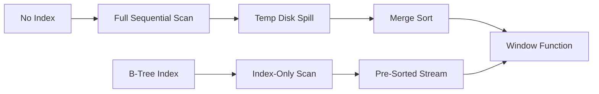

# 📖 Detailed Project Documentation

This documentation provides an in-depth technical analysis of the PostgreSQL Window Functions vs. CTEs Benchmarking Suite, covering mathematical models, query mechanics, optimizations, and comparative trade-offs.

---

## 1. Objective & Main Idea

Modern SaaS dashboards and data-engineering pipelines frequently need to perform complex temporal and partition-based aggregations over large transaction tables. This project isolates and measures two main querying paradigms in PostgreSQL 15:
1.  **Window Functions (WF)**: Inline row computations that retain row identity while executing calculations across partitioned sliding or fixed frames.
2.  **Common Table Expressions (CTEs)**: Declarative, structured temp blocks that split logic sequentially, historically serving as optimization fences but now inlined by default since PG 12.

The goal is to analyze which pattern executes faster, scales better under high concurrency, and benefits more from indexing.

---

## 2. Technical Specifications & Mathematical Models

### Seeding Data Distribution Math
To emulate real-world ecommerce databases, transaction frequency per user should follow a power law (Pareto distribution), where a small fraction of users generate the majority of orders.

#### User ID Power-Law Mapping
A uniform random variable $U \in [0, 1)$ is transformed using a power factor $p = 3.5$:
$$X = \lfloor N \cdot U^{3.5} \rfloor + 1$$
Where:
*   $N = 200,000$ (total users).
*   $U^{3.5}$ skews the distribution heavily towards 0, resulting in small user IDs (1, 2, 3, etc.) receiving thousands of orders, while higher user IDs receive very few or none.

#### Referral Graph DAG Generation
To create a valid Directed Acyclic Graph (DAG) for referral paths, each user `i` can only be referred by a user who signed up before them. The child-parent relationship is generated by:
$$\text{referred\_by}(i) = \begin{cases} \lfloor \text{random}() \cdot (i - 1) + 1 \rfloor & \text{with } 30\% \text{ probability (for } i > 1) \\ \text{NULL} & \text{with } 70\% \text{ probability} \end{cases}$$
This ensures the parent ID is always strictly less than the child ID ($referred\_by(i) < i$), mathematically preventing loops or cycles in the referral tree.

---

## 3. In-Depth Query Operator Breakdowns

### Query 1: Rolling Revenue
*   **Window version**: Uses `AVG(daily_revenue) OVER (ORDER BY day ROWS BETWEEN 6 PRECEDING AND CURRENT ROW)`. The database sorts the daily revenue records by day and utilizes a sliding frame window buffer to compute the running 7-day average in a single pass.
*   **CTE version**: Uses a correlated subquery on the CTE: `SELECT AVG(p.daily_revenue) FROM daily_rev p WHERE p.day BETWEEN r.day - 6 AND r.day`. This avoids window framing functions but requires executing an inner scan for each daily record.

### Query 2: Cohort Spending Ranks
*   **Window version**: Uses `DENSE_RANK() OVER (PARTITION BY cohort_month ORDER BY total_spend DESC)`. The database groups and sorts users by cohort, then assigns ranks.
*   **CTE version**: Ranks are computed using a `LATERAL` subquery limiting results to the top 10 spenders per cohort. Then, the rank is calculated on this tiny 240-row subset by counting how many other users in the same cohort have a strictly greater total spend:
    ```sql
    (SELECT COUNT(DISTINCT ts2.total_spend) + 1 FROM top_spenders_per_cohort ts2 WHERE ts2.cohort_month = ts.cohort_month AND ts2.total_spend > ts.total_spend)
    ```
    This optimization bypasses calculating the $O(N^2)$ ranks across all 200k users.

### Query 3: Extreme Orders
*   **Window version**: Uses `FIRST_VALUE(created_at) OVER (PARTITION BY user_id ORDER BY created_at ASC ROWS BETWEEN UNBOUNDED PRECEDING AND UNBOUNDED FOLLOWING)`. The explicit frame forces PG to scan the entire partition once, extracting both boundary values.
*   **CTE version**: Uses `(ARRAY_AGG(created_at ORDER BY created_at ASC))[1]`. By aggregating transaction values into arrays ordered inside the aggregate, we extract the first and last elements without self-joins.

### Query 4: Customer Churn Risk
*   **Window version**: Uses `LAG(order_count) OVER (PARTITION BY user_id ORDER BY period DESC)`.
*   **CTE version**: Isolates last 30d orders and previous 30d orders in separate CTE blocks, then executes an outer join.

### Query 5: Revenue Share
*   **Window version**: Computes `amount / SUM(amount) OVER (PARTITION BY user_id)`.
*   **CTE version**: Groups `SUM(amount)` by user in a CTE, then joins this aggregated table back to the base `orders` table.

---

## 4. Performance Optimization & Index Strategies

### The B-Tree Index on `orders(user_id, created_at)`
Window functions are extremely sensitive to sorting. Without an index, partitioning requires the query executor to pull all rows, dump them to temporary files on disk (due to the `work_mem` limit), and perform a disk-based merge sort.



By creating the composite B-Tree index on `(user_id, created_at)`, PostgreSQL fetches the rows in the exact order requested by the partition (`PARTITION BY user_id ORDER BY created_at`). The query planner detects this and completely **bypasses the Sort Node**, scanning the pre-sorted index directly.

---

## 5. Architectural Pros, Cons, and Trade-offs

| Strategy | Advantages / Pros | Disadvantages / Cons | Recommended Use Cases |
| :--- | :--- | :--- | :--- |
| **Window Functions** | - Single-pass calculations<br>- Expressive and concise syntax<br>- Leverages index-sorted streams | - Requires strict partition sorting<br>- Syntax can feel complex<br>- High memory overhead if unsorted | Sliding averages, cohorts, running totals, lead/lag comparisons. |
| **Common Table Expressions** | - Excellent readability and modularity<br>- Easy to debug sequential blocks<br>- Materialization can cache shared CTEs | - Historical optimization fence<br>- Can lead to nested loop joins ($O(N^2)$)<br>- High latency under concurrency | Decomposing multi-step business logic, lateral subqueries. |
| **Materialized Views** | - High performance reads ($O(1)$)<br>- Pre-computed aggregations on disk<br>- Bypasses CPU-intensive calculations | - Data staleness<br>- Write amplification during refresh<br>- Storage space usage | Dashboards, daily/hourly reporting, heavy analytical summaries. |

---

## 6. Verification and Testing Protocols

To verify database integrity and benchmark stability, the following verification strategy is implemented:

### Database Verification Checks
1.  **Count Constraint**: Confirm database size satisfies the minimum baseline:
    ```sql
    ASSERT (SELECT count(*) FROM users) = 200000;
    ASSERT (SELECT count(*) FROM orders) = 1000000;
    ```
2.  **Referential Integrity Constraint**: Verify `referred_by` contains only valid user IDs:
    ```sql
    ASSERT (SELECT count(*) FROM users WHERE referred_by IS NOT NULL AND referred_by NOT IN (SELECT user_id FROM users)) = 0;
    ```

### Benchmark Consistency Checks
1.  **Query Output Parity**: For every query $Q_i$, the suite validates that:
    $$\text{Result}(window\_q_i) \equiv \text{Result}(cte\_q_i)$$
2.  **Performance Auditing**: The suite executes `run_benchmarks.py` to confirm that:
    *   Index creation succeeds.
    *   Explain plan JSON files are created in the `benchmarks/` folder.
    *   Sort types change from `external merge` to `[]` where applicable.
    *   The `results/benchmarks.json` file is successfully written.
